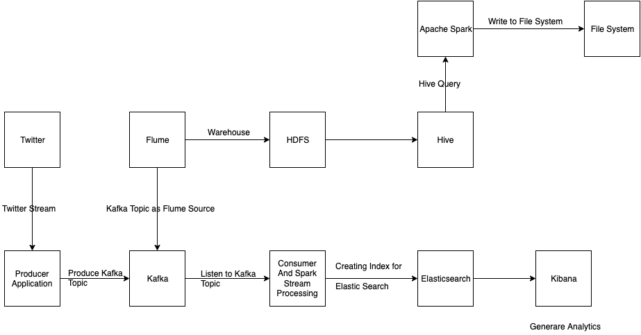
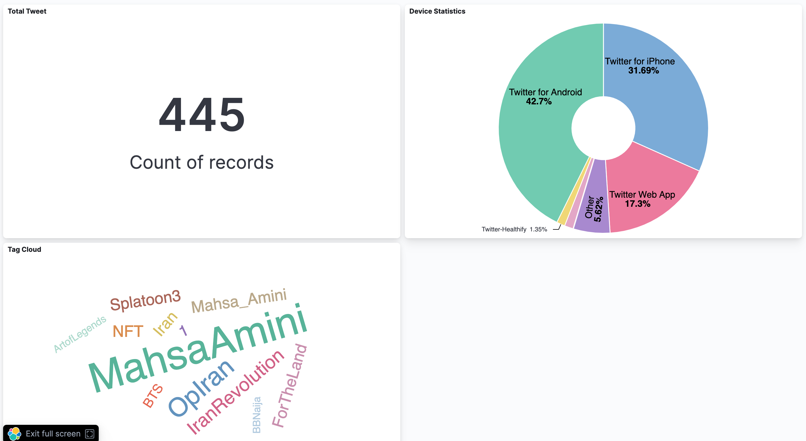

#  Big Data Technology (CS523)
## Twitter Analytics

### STEP 1: Run Docker Containers
```
$ docker compose up -d
```
### STEP 2: Run tweet-from-twitter-streams Application
```
$ cd tweet-from-twitter-streams
$ mvn clean package spring-boot:run
```
### STEP 3: Run kafka-spark Application
```
$ cd kafka-spark
$ mvn clean package spring-boot:run -DskipTests
```
### STEP 4: Goto Elastic Search Kibana Console and Dashboard
http://localhost:5601/app/dev_tools#/console?_g=()

http://localhost:5601/app/dashboards#/

Run some ES command to see that data is indexed

```
GET /tweets/_count?

GET /tweets/_search
{
  "query": {
    "match_all": {}
  }
}
```


### Step 5: Copy twitter.csv file to HDFS
hadoop fs -mkdir /user/cloudera/finalProject

hadoop fs -mkdir /user/cloudera/finalProject/twitter

hadoop fs -mkdir /user/cloudera/finalProject/twitter/input

hadoop fs -put twitter.csv /user/cloudera/finalProject/twitter/input

### STEP 6: Run Hive Query on Cloudera VM
```
CREATE DATABASE twitter;

USE twitter;

CREATE EXTERNAL TABLE tweets (
        username    STRING,
        hashtag     STRING,
        moment      STRING
)
ROW FORMAT SERDE 'org.apache.hadoop.hive.serde2.OpenCSVSerde'
WITH SERDEPROPERTIES (
	"separatorChar" = ",",
        "quoteChar"     = "\""
)
LOCATION 'user/cloudera/finalProject/twitter'
```
### STEP 7: Build and run spark-sql Application on Cloudera
```
$ cd hive-spark
$ mvn clean package
java -cp target/sync-hive-spark-1.0-SNAPSHOT.jar edu.miu.bdt.HiveSparkApplication /home/cloudera/BDT/finalProject/twitter/hive-spark
```